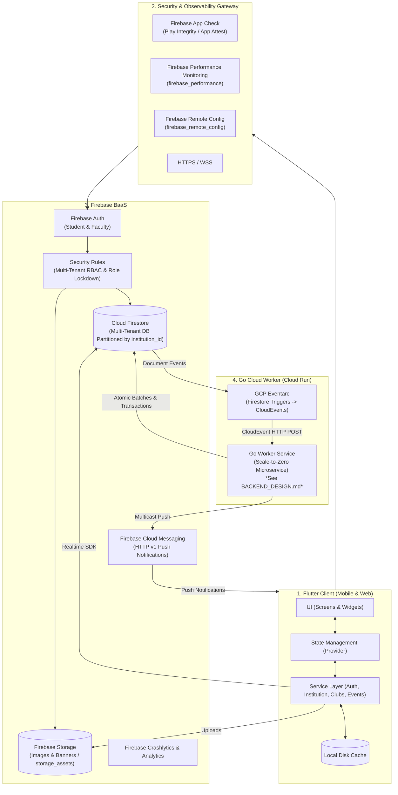
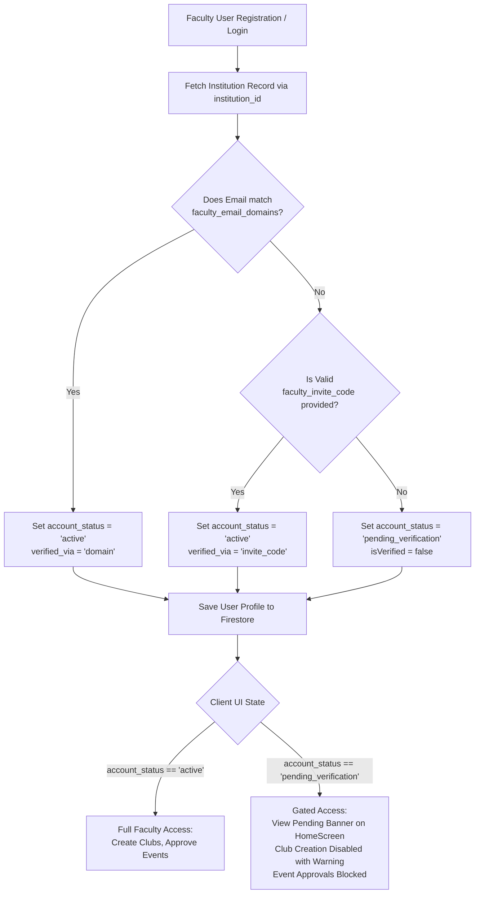

# KlubConnect — System Architecture

**Product:** KlubConnect Multi-Tenant College Community Platform  
**Client:** Flutter (Android, iOS, Web)  
**BaaS:** Firebase (Auth, Firestore, Storage, Cloud Messaging, App Check, Performance Monitoring, Remote Config, Crashlytics, Analytics)  
**Backend:** Go on Google Cloud Run  
**Event Ingress:** GCP Eventarc (CloudEvents v1.0)  
**Backend Details:** See [`BACKEND_DESIGN.md`](BACKEND_DESIGN.md)  

---

## 1. Overview & System Design

KlubConnect utilizes a **hybrid cloud architecture**:
* **Flutter client** interfaces directly with **Firebase** for responsive user interactions, live data streams, offline caching, and glassmorphic UI presentation.
* **Go microservice on Google Cloud Run** handles background processing, atomic multi-collection transactions, idempotent event processing, push notification fanout with stale token hygiene, and tamper-proof audit logging triggered through **GCP Eventarc**.



---

## 2. Technology Stack

| Layer | Technology | Usage |
|---|---|---|
| **Mobile App** | Flutter (Dart 3.x) | Cross-platform UI for Android, iOS, and Web |
| **State Management** | Provider | View models and stream subscriptions |
| **UI Design System** | Material 3 & Glassmorphism | Custom `GlassPanel`, `AppTheme`, and centralized `AppSnackBar` |
| **Authentication** | Firebase Auth | Email/Password, Magic Links, and Phone OTP |
| **Device Integrity** | Firebase App Check | Play Integrity (Android) and App Attest (iOS) |
| **Database** | Cloud Firestore | Multi-tenant NoSQL document store partitioned by `institution_id` |
| **Media Storage** | Firebase Storage | Profile images and club/event banners with `storage_assets` indexing |
| **Push Notifications** | Firebase Cloud Messaging | Multicast push notifications via HTTP v1 API |
| **Performance Monitoring** | `firebase_performance: ^0.10.1` | Network latency, screen rendering, and runtime performance tracking |
| **Remote Config** | `firebase_remote_config: ^5.3.4` | Dynamic feature flags, operational thresholds, and kill switches |
| **Crash Reporting** | `firebase_crashlytics: ^5.0.4` | Real-time crash diagnostics and non-fatal logging |
| **Product Analytics** | `firebase_analytics: ^12.0.3` | User engagement funnels and lifecycle metrics |
| **Event Routing** | GCP Eventarc | Delivers Firestore mutation events (CloudEvents v1.0) to the Go worker |
| **Backend Worker** | Go 1.22 on Cloud Run | Server-side business logic, atomic batches, and idempotent handlers |
| **Secrets** | GCP Secret Manager | Manages runtime API keys, service accounts, and credentials |

---

## 3. Flutter App Architecture

The client application is organized into layered components:

```
┌─────────────────────────────────────────────────────────────┐
│                     Presentation Layer                      │
│        Screens, Panel, AppTheme, and AppSnackBar       │
└──────────────────────────────┬──────────────────────────────┘
                               │ User Actions / Live Streams
┌──────────────────────────────▼──────────────────────────────┐
│                    State Management Layer                   │
│                     Provider ViewModels                     │
└──────────────────────────────┬──────────────────────────────┘
                               │ Service Calls
┌──────────────────────────────▼──────────────────────────────┐
│                        Service Layer                        │
│   Auth, Institution, Club, Event, Membership, Notification  │
└──────────────────────────────┬──────────────────────────────┘
                               │ Direct SDK Connection
┌──────────────────────────────▼──────────────────────────────┐
│                  Firebase SDK & Local Cache                 │
└─────────────────────────────────────────────────────────────┘
```

### Presentation Layer & AppSnackBar Utility

UI feedback is centralized through `AppSnackBar` (`lib/utils/app_snackbar.dart`), replacing third-party toast dependencies:
* **Visual Styling**: Frosted glassmorphism built using `BackdropFilter` with Gaussian blur (`sigmaX: 18, sigmaY: 18`), translucent white container (`Colors.white.withValues(alpha: 0.90)`), subtle 1.2px border, and smooth elevation shadow.
* **Layout**: Floating behavior (`SnackBarBehavior.floating`) positioned above navigation surfaces.
* **Semantic Variants**:
  * `AppSnackBar.showSuccess`: Success notifications with `AppTheme.successColor` and `Icons.check_circle_rounded`.
  * `AppSnackBar.showError`: Error alerts with `AppTheme.errorColor` and `Icons.error_outline_rounded`.
  * `AppSnackBar.showWarning`: Warning messages with `AppTheme.warningColor` and `Icons.warning_amber_rounded`.
  * `AppSnackBar.showInfo`: Informational messages with `AppTheme.primaryColor` and `Icons.info_outline_rounded`.
* **Global Context Fallback**: Resolves active `BuildContext` from either the calling widget or `AppRouter.currentContext`.

### Service Layer Overview

* **`AuthService`**: Handles login, registration, OTP verification, magic links, session state, and cooldown timers.
* **`InstitutionService`**: Manages institution lookup, dual-mode faculty verification, domain whitelist validation, and invite code verification.
* **`FirestoreService`**: Manages user profiles, keyword search indexing (`SearchIndexUtils`), and online presence.
* **`ClubService`**: Handles club creation, metadata updates, and member queries.
* **`EventService`**: Manages event proposal, review workflows, RSVPs, and calendar listings.
* **`MembershipService`**: Manages join requests, status tracking, and subcollection membership queries.
* **`AnnouncementService`**: Handles club announcements and pin toggling.
* **`NotificationService`**: Registers FCM device tokens and listens for in-app notification queues.
* **`ImageUploadService`**: Compresses images via `flutter_image_compress` and uploads them to Firebase Storage.
* **`AuditLogService`**: Client-side helper that creates append-only audit log entries in `audit_logs`.

---

## 4. Multi-Tenancy & Zero-Trust Security

### Multi-Tenant Isolation Model

Every college community is strictly isolated by an immutable `institution_id` across three enforcement tiers:
1. **Client Scoping**: Queries in `ClubService`, `EventService`, and `FirestoreService` filter by the user's `institution_id`.
2. **Firestore Security Rules**: Rules enforce `sameTenant()` and `sameInstitution()` checks on all reads and writes.
3. **Backend Assertions**: The Go worker verifies matching `institution_id` values between users, clubs, and membership requests before executing transactions, rejecting discrepancies with `ErrTenantMismatch` (HTTP 403).

### Zero-Trust Role Array Lockdown

To prevent privilege escalation attacks:
1. **Role Array Client Lockdown**: Direct client updates to user role arrays (`is_president_of`, `is_organizer_of`, `clubs_joined`, `clubs_created`) in `users/{userId}` are strictly denied by `firestore.rules`.
2. **Safe Profile Field Whitelist**: Updates to `/users/{userId}` are limited to the document owner and a strict whitelist of 15 non-sensitive profile fields:
   * `first_name`, `last_name`, `full_name`, `full_name_lower`, `search_keywords`, `about`, `phone_number`, `profile_image_url`, `fcm_token`, `last_token_updated_at`, `last_login_at`, `is_online`, `last_active_at`, `profile_completed`, `updated_at`.
3. **Relationship Subcollections**: Memberships are modeled as distinct documents in subcollections:
   * `clubs/{clubId}/memberships/{userId}`
   * `users/{userId}/club_memberships/{clubId}`
4. **Backend Role Synchronization**: Leadership assignments and membership approvals are executed atomically by verified server workers.

---

## 5. Dual-Mode Faculty Verification Architecture

Institutional authority requires verified faculty status before users can create clubs or approve campus events.



### Verification Data Flow
1. **`InstitutionModel`**: Stores verified domain suffixes (`faculty_email_domains: ['mit.edu', 'cs.mit.edu']`) and authorized onboarding codes (`faculty_invite_codes: ['FAC-2026-ENG', 'FAC-2026-MED']`).
2. **`InstitutionService.verifyFaculty`**:
   * Evaluates email against institution faculty domains.
   * If domain verification fails, validates the provided invite code against `faculty_invite_codes`.
   * If both checks fail, marks the account `pending_verification`.
3. **Firestore Rule Enforcement**: The `clubs/{clubId}` create rule requires:
   `currentUser().user_type == 'faculty' && (!currentUser().keys().hasAny(['account_status']) || currentUser().account_status == 'active')`.
4. **Presentation Gating**:
   * `HomeScreen`: Renders a glassmorphic status alert banner when `user.isPendingVerification`.
   * `CreateClubScreen` / `ClubListScreen`: Prevents unverified faculty from creating clubs and displays warning feedback.
   * `EventDetailsScreen`: Restricts event approvals to active faculty mentors.

---

## 6. Firestore Database Structure

```
Cloud Firestore
├── institutions/{institutionId}            # Verified institutions (read-only for clients)
│
├── users/{userId}                          # User profiles (restricted to safe profile fields)
│   ├── devices/{deviceId}                  # FCM device tokens
│   └── club_memberships/{clubId}           # Denormalized membership mirror per user
│
├── clubs/{clubId}                          # Club information and leadership
│   ├── members/{userId}                    # Quick member lookup subcollection
│   └── memberships/{userId}                # Membership status and history
│
├── events/{eventId}                        # Events and aggregate participant counters
│   └── rsvps/{userId}                      # User RSVP state (attending, interested, not_going)
│
├── membership_requests/{requestId}         # Student join requests
│
├── announcements/{announcementId}          # Club announcements (top-level collection)
│
├── notifications/{notificationId}          # Notification queue
│
├── audit_logs/{auditLogId}                 # Append-only audit trail
│
├── storage_assets/{assetId}                # Metadata for uploaded images and banners
│
└── go_worker_state/{handler}_{eventId}     # Idempotency lock records (Go worker exclusive)
```

### Write Permissions Matrix

| Collection | Client Access | Worker Access | Security Rules Policy |
|---|---|---|---|
| `institutions` | Read-only | None | `allow write: if false` |
| `users` | Write 15 safe profile fields | Update status & roles | `request.auth.uid == userId` & field whitelist |
| `users/{id}/devices` | Read/create/update own | Delete dead tokens | `request.auth.uid == userId` |
| `users/{id}/club_memberships` | Read own | Approval writes | `request.auth.uid == userId` or `isClubManager()` |
| `clubs` | Active Faculty create / Manager edit | Member updates | `user_type == "faculty" && account_status == "active"` |
| `clubs/{id}/memberships` | Member create / Manager update | Read-only | `sameCollegeAsClub()` |
| `events` | Role holders create / edit | RSVP count sync | `isClubRoleHolder()` / `isClubMaster()` |
| `events/{id}/rsvps` | Write own RSVP | Read-only | `request.auth.uid == userId` |
| `membership_requests` | Student create / Manager update | Read-only | `sameCollegeAsClub()` |
| `announcements` | Club manager create/update/delete | None | `isClubManager()` |
| `notifications` | Create + read/update own | Update dispatch status | `sameTenant()` |
| `audit_logs` | Create own-actor entry only | Write audit logs | Actor UID match + tenant check (`allow update, delete: if false`) |
| `storage_assets` | Create/update own asset metadata | None | Owner UID match + image MIME & size check |
| `go_worker_state` | **No access** | Read / write locks | `allow read, write: if false` |

---

## 7. Asynchronous Go Backend Integration

When a state transition requires server-side validation, cross-collection atomicity, or transactional counter synchronization, Firestore emits a **CloudEvent** to the Go worker via **GCP Eventarc**:

```
Firestore Mutation ──> GCP Eventarc ──(CloudEvent HTTP POST)──> Go Worker on Cloud Run
```

### Core Backend Worker Responsibilities:
1. **Membership Approvals (`/events/membership`)**: Validates tenant IDs and executes an atomic 4-collection batch write (`memberships`, `user_memberships`, `clubs.members`, and `notifications`).
2. **RSVP Counters (`/events/rsvp`)**: Executes Firestore transactions on `events/{eventId}` applying delta increments/decrements to `current_participants`, `interested_count`, and `not_going_count`.
3. **Push Notifications (`/events/fcm`)**: Dispatches multicast push notifications via Firebase Cloud Messaging HTTP v1 API and deletes invalid/unregistered FCM tokens.
4. **Tamper-Proof Audit Logs (`/events/audit`)**: Records audit entries containing actor ID, target collection, document ID, action type, and changed fields.
5. **Idempotency Guard**: Implements a two-phase lock in `go_worker_state` ensuring duplicate Eventarc retries do not trigger duplicate mutations.

> For handler code details, delta counter logic, and idempotency state machines, see [**`BACKEND_DESIGN.md`**](BACKEND_DESIGN.md).
