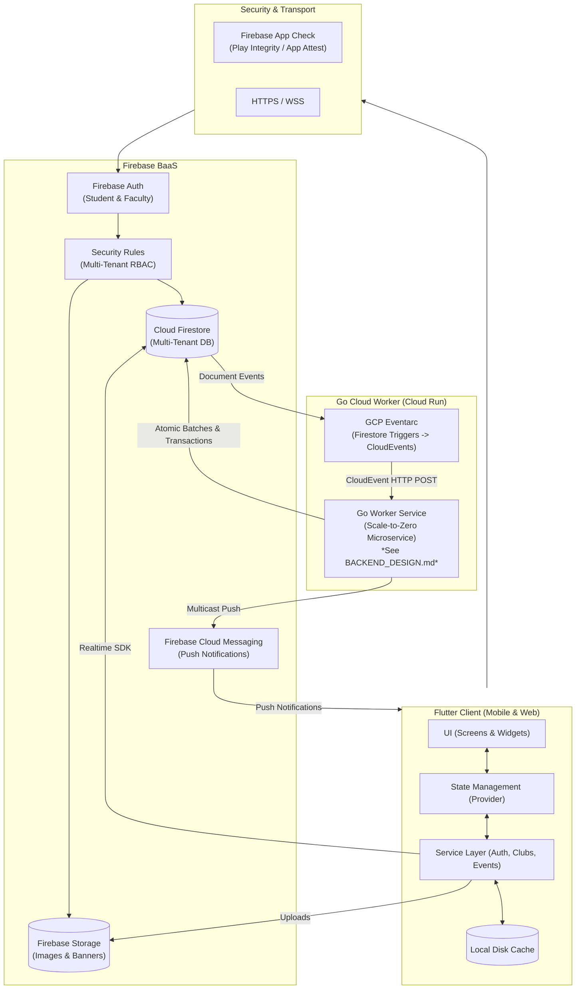

# KlubConnect — System Architecture

**Product:** KlubConnect College Community Platform  
**Client:** Flutter (Android, iOS, Web)  
**BaaS:** Firebase (Auth, Firestore, Storage, Cloud Messaging, App Check)  
**Backend:** Go on Google Cloud Run  
**Event Ingress:** GCP Eventarc (CloudEvents v1.0)  
**Backend Details:** See [`BACKEND_DESIGN.md`](BACKEND_DESIGN.md)  

---

## 1. Overview & System Design

KlubConnect uses a **hybrid cloud architecture**:
* **Flutter client** connects directly to **Firebase** for responsive user interactions, live data updates, and offline caching.
* **Go microservice on Google Cloud Run** handles background processing, atomic database transactions, notification dispatches, and audit logging triggered through **GCP Eventarc**.



---

## 2. Technology Stack

| Layer | Technology | Usage |
|---|---|---|
| **Mobile App** | Flutter (Dart 3.x) | Cross-platform UI for Android, iOS, and Web |
| **State Management** | Provider | View models and stream subscriptions |
| **Authentication** | Firebase Auth | Email/Password, Magic Links, and Phone OTP |
| **Device Integrity** | Firebase App Check | Play Integrity (Android) and App Attest (iOS) |
| **Database** | Cloud Firestore | Multi-tenant NoSQL document store |
| **Media Storage** | Firebase Storage | Profile images and club/event banners |
| **Push Notifications** | Firebase Cloud Messaging | Push notifications via HTTP v1 API |
| **Event Routing** | GCP Eventarc | Delivers Firestore mutation events to the Go worker |
| **Backend Worker** | Go 1.22 on Cloud Run | Server-side business logic and atomic transactions |
| **Secrets** | GCP Secret Manager | Manages runtime API keys and credentials |

---

## 3. Flutter App Architecture

The mobile app is structured into clean, focused layers:

```
┌─────────────────────────────────────────────────────────────┐
│                     Presentation Layer                      │
│                Screens and Reusable Widgets                 │
└──────────────────────────────┬──────────────────────────────┘
                               │ User Actions / Live Streams
┌──────────────────────────────▼──────────────────────────────┐
│                    State Management Layer                   │
│                     Provider ViewModels                     │
└──────────────────────────────┬──────────────────────────────┘
                               │ Service Calls
┌──────────────────────────────▼──────────────────────────────┐
│                        Service Layer                        │
│         Business logic for Auth, Clubs, Events, etc.        │
└──────────────────────────────┬──────────────────────────────┘
                               │ Direct SDK Connection
┌──────────────────────────────▼──────────────────────────────┐
│                  Firebase SDK & Local Cache                 │
└─────────────────────────────────────────────────────────────┘
```

### Service Layer Overview

* **`AuthService`**: Handles login, registration, OTP verification, and session state.
* **`FirestoreService`**: Manages user profiles, keyword search indexing, and online presence.
* **`ClubService`**: Handles club creation, updates, and member management.
* **`EventService`**: Manages event creation, RSVPs, and calendar listings.
* **`MembershipService`**: Manages join requests and club memberships.
* **`AnnouncementService`**: Handles club announcements and pin toggling.
* **`NotificationService`**: Registers FCM device tokens and listens for in-app notifications.
* **`ImageUploadService`**: Compresses and uploads images to Firebase Storage.

---

## 4. Multi-Tenancy & Security

Each college community is isolated by an `institution_id` across three validation steps:

1. **Client Queries**: The Flutter app scopes queries to the user's `institution_id`.
2. **Firestore Security Rules**: Rules enforce `sameTenant()` checks on reads and writes.
3. **Backend Assertions**: The Go worker verifies matching `institution_id` values across users, clubs, and requests before running transactions.

### User Roles
* **Student**: Joins clubs, attends events, and views announcements.
* **Organizer**: Student member permitted to organize and edit club events.
* **President**: Student club head who manages details, members, and announcements.
* **Faculty / Club Master**: Faculty mentor who creates clubs and approves events.

---

## 5. Firestore Database Structure

```
Cloud Firestore
├── users/{userId}                          # User profiles and academic info
│   └── devices/{deviceId}                  # FCM device tokens
│
├── clubs/{clubId}                          # Club information and leadership
│   ├── members/{userId}                    # Quick member lookup sub-collection
│   ├── memberships/{userId}                # Membership history and status
│   └── announcements/{announcementId}      # Club announcements
│
├── events/{eventId}                        # Events and participant counts
│   └── rsvps/{userId}                      # User RSVP state (going, interested, not_going)
│
├── membership_requests/{requestId}         # Student join requests
│
├── notifications/{notificationId}          # Notification queue
│
├── audit_logs/{auditLogId}                 # Append-only audit trail (written by Go worker)
│
└── go_worker_state/{handler}_{eventId}     # Idempotency lock records (managed by Go worker)
```

### Write Permissions

| Collection | Client Access | Worker Access | Rules Rule |
|---|---|---|---|
| `users` | Write own profile | Status updates | `request.auth.uid == userId` |
| `clubs` | Faculty create / Manager edit | Member updates | `user_type == "faculty"` / `isClubManager()` |
| `events` | Role holders create / edit | Counter sync | `isClubRoleHolder()` / `isClubMaster()` |
| `events/{id}/rsvps` | Write own RSVP | Read-only | `request.auth.uid == userId` |
| `membership_requests`| Student create / Manager update | Read-only | `sameCollegeAsClub()` |
| `notifications` | Create notification | Update dispatch status | `sameTenant()` |
| `audit_logs` | **No write access** | Write audit logs | `allow write: if false` |
| `go_worker_state` | **No access** | Read / write locks | `allow read, write: if false` |

---

## 6. Asynchronous Go Backend Integration

When an event requires server-side validation or atomic updates across multiple collections, Firestore sends a **CloudEvent** to the Go worker via **GCP Eventarc**:

```
Firestore Change ──> GCP Eventarc ──(CloudEvent HTTP POST)──> Go Worker on Cloud Run
```

### Core Backend Tasks:
1. **Membership Approvals**: Validates tenant IDs and runs an atomic 4-collection batch write (`memberships`, `user_memberships`, `clubs.members`, and `notifications`).
2. **RSVP Counters**: Updates event participant counts inside a transaction to prevent race conditions during busy event launches.
3. **Push Notifications**: Sends multicast push messages via FCM and automatically removes stale/invalid device tokens.
4. **Audit Logs**: Records immutable audit entries on changes to clubs, events, and memberships.
5. **Idempotency Guard**: Uses a two-phase lock in `go_worker_state` to prevent duplicate execution from Eventarc retries.

> For handler code details, delta counter logic, and idempotency state machines, see [**`BACKEND_DESIGN.md`**](BACKEND_DESIGN.md).
