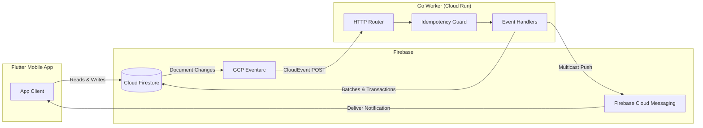
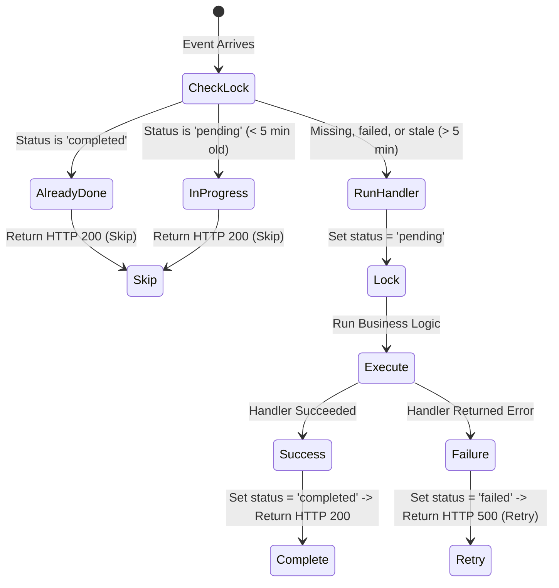
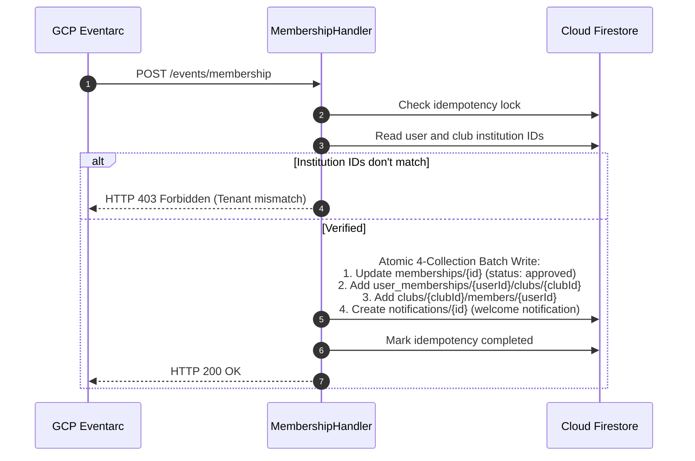
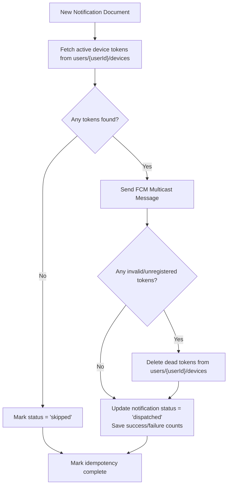

# KlubConnect — Go Backend Design

**Service:** Go Background Worker  
**Runtime:** Go 1.22+ on Google Cloud Run  
**Event Source:** GCP Eventarc (CloudEvents v1.0)  
**Database:** Cloud Firestore  
**Notifications:** Firebase Cloud Messaging (FCM)  

---

## 1. Overview

The Go backend handles tasks that shouldn't be executed directly on mobile devices:
1. **Multi-Collection Updates:** Approving a membership updates 4 collections at once. If a phone loses connection halfway through, data gets corrupted. The server handles this in a single atomic batch.
2. **Busy Event RSVPs:** During popular events, hundreds of students tap RSVP at the same time. The server uses Firestore transactions to update counts safely without write collisions.
3. **Push Notifications & Cleanup:** Sends notifications to all user devices and automatically deletes dead or expired FCM tokens.
4. **Audit Logs:** Records important actions in a tamper-proof log that regular users cannot edit or delete.
5. **No Idle Costs:** Runs on Cloud Run, which scales to zero when there are no events to process.



---

## 2. HTTP Endpoints & Event Routing

The server runs on standard Go HTTP routing with logging and panic recovery middleware:

| Endpoint | Ingress Method | Trigger / Event Source | What it does |
|---|---|---|---|
| `/events/membership` | POST | `membership_requests/{id}` updated to `approved` | Verifies tenant IDs and runs the 4-collection approval batch |
| `/events/rsvp` | POST | `events/{id}/rsvps/{userId}` created or updated | Updates participant and interested counts in a transaction |
| `/events/fcm` | POST | `notifications/{id}` created | Sends multicast push notifications and removes dead tokens |
| `/events/audit` | POST | Changes to clubs, events, or requests | Writes an immutable audit entry |
| `/healthz` | GET | Cloud Run health check | Returns `{"status":"ok"}` for container readiness |

### CloudEvent Parsing
The server accepts both:
- **Binary mode:** Metadata in headers (`ce-id`, `ce-subject`), document payload in the body.
- **Structured mode:** Complete JSON envelope containing `id`, `subject`, and `data`.

---

## 3. Idempotency (Preventing Duplicate Events)

Eventarc delivers messages with **at-least-once** guarantees. If network hiccups or retries occur, the same event could arrive multiple times. The server uses a two-phase lock in Firestore (`go_worker_state` collection) to make sure each event only runs once.



### Idempotency Document (`go_worker_state/{handlerName}_{eventId}`)

| Field | Type | Description |
|---|---|---|
| `event_id` | `string` | CloudEvent ID |
| `handler_name` | `string` | Name of the handler (e.g. `membership_handler`) |
| `status` | `string` | `pending`, `completed`, or `failed` |
| `processed_at` | `timestamp` | Time of the last update |
| `error` | `string` | Error details if failed |
| `attempt` | `int` | Number of execution attempts |

---

## 4. Subsystems & Business Logic

### 4.1. Membership Approvals (`/events/membership`)

When a club leader approves a membership request:



---

### 4.2. RSVP Counter Updates (`/events/rsvp`)

When users change their RSVP status (`going`, `interested`, `not_going`), the server calculates the change delta:

| Status | Going Delta | Interested Delta | Not Going Delta |
|---|---|---|---|
| `"going"` | +1 | 0 | 0 |
| `"interested"` | 0 | +1 | 0 |
| `"not_going"` | 0 | 0 | +1 |

```text
delta_going       = new_going - old_going
delta_interested  = new_interested - old_interested
delta_not_going   = new_not_going - old_not_going
```

Inside a transaction on `events/{eventId}`:
```text
new_participants = max(0, current_participants + delta_going)
new_interested   = max(0, interested_count + delta_interested)
new_not_going    = max(0, not_going_count + delta_not_going)
```
If all deltas are 0 (no actual change), the database write is skipped.

---

### 4.3. Push Notifications & Token Cleanup (`/events/fcm`)

When a notification document is added:



---

### 4.4. Audit Logging (`/events/audit`)

Records important changes to clubs, events, and membership requests. Clients cannot write to `audit_logs` directly; only the Go worker running with server credentials can add records:

```json
{
  "audit_id": "audit_ce_9a8b7c_1723680000000000000",
  "cloud_event_id": "9a8b7c-4d3e-2f1a",
  "actor_id": "user_123",
  "target_collection": "clubs",
  "target_document_id": "club_456",
  "action": "UPDATE",
  "timestamp": "2026-08-15T00:00:00Z",
  "changed_fields": ["president_id", "updated_at"]
}
```

---

## 5. Collection Ownership

| Collection | Client Permissions | Go Worker Permissions | Security Rule |
|---|---|---|---|
| `users` | Edit own profile | Update status | User ID match |
| `clubs` | Faculty create / Manager edit | Member updates | Faculty / Manager check |
| `events` | Role holders create / edit | RSVP count updates | Role check |
| `events/{id}/rsvps` | Write own RSVP | Read-only | User ID match |
| `membership_requests`| Student create / Manager edit | Read-only | Tenant check |
| `notifications` | Create notifications | Update dispatch status | Tenant check |
| `audit_logs` | **No write access** | Write audit logs | Server only (`allow write: if false`) |
| `go_worker_state` | **No access** | Read / write locks | Server only (`allow read, write: if false`) |

---

## 6. Secrets & Environment Config

Configuration is read on startup from environment variables and **GCP Secret Manager**:

* `PORT`: Server port (default: `8080`)
* `APP_ENV`: `development`, `test`, or `production`
* `GCP_PROJECT_ID`: GCP project ID (default: `klubconnect-prod`)
* `USE_SECRET_MANAGER`: `true` in production to fetch the FCM server key securely
* `FCM_SERVER_KEY`: Local environment fallback key

---

## 7. Graceful Shutdown & Health Probes

* **Health Probe (`GET /healthz`):** Cloud Run uses this endpoint to confirm the container is running and healthy.
* **Graceful Shutdown:** When Cloud Run stops or replaces a container, it sends a `SIGTERM` signal. The worker catches this signal and gives active database transactions up to **10 seconds** to complete before shutting down cleanly.
