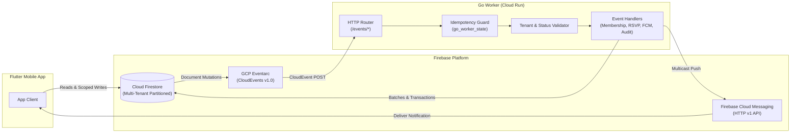
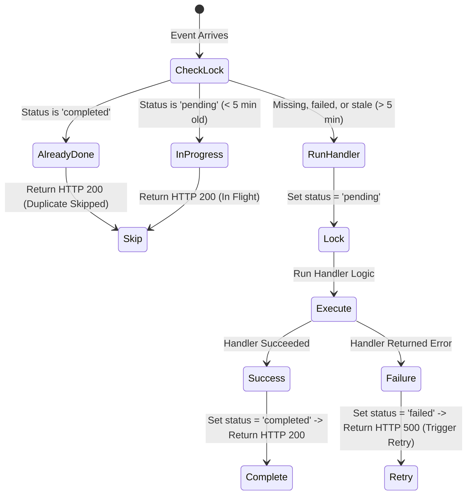
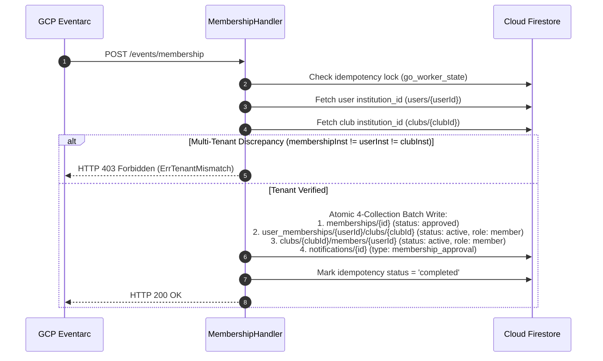
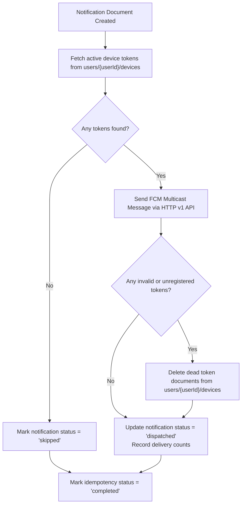

# KlubConnect — Go Backend Design

**Service:** Go Background Worker  
**Runtime:** Go 1.22+ on Google Cloud Run  
**Event Source:** GCP Eventarc (CloudEvents v1.0)  
**Database:** Cloud Firestore (Multi-Tenant Partitioning by `institution_id`)  
**Notifications:** Firebase Cloud Messaging (FCM HTTP v1 API)  

---

## 1. Overview

The Go backend handles tasks that shouldn't be executed directly on mobile devices:
1. **Multi-Tenant Isolation Verification:** Enforces tenant boundaries by comparing `institution_id` across users, clubs, and requests before executing any database mutation.
2. **Backend Role Synchronization:** Membership approvals require synchronized updates across 4 collections (`memberships`, `user_memberships`, `clubs.members`, and `notifications`). The server commits these in a single atomic batch.
3. **High-Concurrency RSVP Aggregation:** Popular campus events generate hundreds of concurrent RSVPs. The worker uses Firestore transactions to atomically calculate and apply delta counters without race conditions.
4. **Push Notifications & Token Hygiene:** Sends FCM multicast messages across active device tokens and prunes dead, uninstalled, or expired tokens.
5. **Immutable Audit Logs:** Records tamper-proof audit trails for all critical entity modifications that cannot be modified or deleted by clients.
6. **Account Status Enforcement:** Validates `account_status` (`active`, `pending_verification`, `suspended`, `rejected`) preventing unverified or suspended users from performing privileged actions.
7. **Scale-to-Zero Efficiency:** Runs as a serverless container on Cloud Run with zero idle compute cost.



---

## 2. HTTP Endpoints & Event Routing

The Go service exposes endpoints matching GCP Eventarc trigger subscriptions with structured logging and recovery middleware:

| Endpoint | Ingress Method | Trigger / Event Source | What it does |
|---|---|---|---|
| `/events/membership` | POST | `membership_requests/{id}` or `memberships/{id}` status updated to `approved` | Verifies tenant isolation and executes 4-collection atomic membership batch |
| `/events/rsvp` | POST | `events/{id}/rsvps/{userId}` created or updated | Aggregates participant, interested, and not-going counts in a transaction |
| `/events/fcm` | POST | `notifications/{id}` created | Dispatches multicast push notifications and prunes invalid device tokens |
| `/events/audit` | POST | Firestore document mutations on clubs, events, or requests | Writes an immutable audit entry to `audit_logs` |
| `/healthz` | GET | Cloud Run health probe | Returns container readiness status `{"status":"ok"}` |

### CloudEvent Parsing

The service handles both standard CloudEvents v1.0 delivery modes:
* **Binary Mode:** Metadata passed in HTTP headers (`ce-id`, `ce-subject`, `ce-type`), with the Firestore `DocumentEventData` payload in the request body.
* **Structured Mode:** JSON envelope containing top-level `id`, `subject`, `type`, and `data` fields.

---

## 3. Idempotency & Fault Tolerance

Eventarc guarantees **at-least-once** delivery. Network retries or infrastructure restarts can redeliver identical events. The worker prevents duplicate side effects using a two-phase lock in Firestore (`go_worker_state` collection).



### Idempotency Document (`go_worker_state/{handlerName}_{eventId}`)

| Field | Type | Description |
|---|---|---|
| `event_id` | `string` | Unique CloudEvent identifier |
| `handler_name` | `string` | Target handler identifier (e.g. `membership_handler`, `AuditHandler`) |
| `status` | `string` | Lock state: `pending`, `completed`, or `failed` |
| `processed_at` | `timestamp` | Timestamp of last lock acquisition or completion |
| `error` | `string` | Formatted error string if execution failed |
| `attempt` | `int` | Execution attempt counter |

---

## 4. Subsystems & Business Logic

### 4.1. Multi-Tenant Verification & Membership Approvals (`/events/membership`)

When a club leader approves a membership request, the worker verifies tenant isolation before applying changes:



### 4.2. RSVP Counter Aggregation (`/events/rsvp`)

When a student updates their RSVP response (`attending`, `interested`, `not_going`), the worker calculates delta changes:

| New Response | Old Response | Delta Going | Delta Interested | Delta Not Going |
|---|---|---|---|---|
| `"attending"` | `null` | +1 | 0 | 0 |
| `"interested"` | `null` | 0 | +1 | 0 |
| `"not_going"` | `null` | 0 | 0 | +1 |
| `"attending"` | `"interested"` | +1 | -1 | 0 |
| `"not_going"` | `"attending"` | -1 | 0 | +1 |

Inside a Firestore transaction on `events/{eventId}`:
```text
new_participants = max(0, current_participants + delta_going)
new_interested   = max(0, interested_count + delta_interested)
new_not_going    = max(0, not_going_count + delta_not_going)
```
If all deltas equal 0 (no net change), the transaction commit is skipped.

### 4.3. Push Notifications & Token Hygiene (`/events/fcm`)

When a new document appears in `notifications/{id}`:



### 4.4. Tamper-Proof Audit Logging (`/events/audit`)

Records auditable events across clubs, events, and memberships. Client applications are forbidden from modifying or deleting audit logs.

#### Audit Record Schema (`audit_logs/{auditId}`):
```json
{
  "audit_id": "audit_ce_9a8b7c_1723680000000000000",
  "cloud_event_id": "9a8b7c-4d3e-2f1a",
  "actor_id": "user_mit_faculty_101",
  "institution_id": "mit_edu",
  "target_collection": "clubs",
  "target_document_id": "club_robotics_404",
  "action": "UPDATE",
  "timestamp": "2026-08-30T17:30:00Z",
  "changed_fields": ["president_id", "updated_at"]
}
```

The Go worker extracts changed fields using the Firestore `UpdateMask` or compares before-and-after document snapshots.

---

## 5. Account Status Validation & Security Rules Integration

### Account Status Lifecycle

```
[Registration / Login]
         │
         ▼
┌───────────────────────────────────────────────┐
│ InstitutionService.verifyFaculty              │
│ - Mode 1: Domain Whitelist Check              │
│ - Mode 2: Authorized Invite Code Check        │
└───────────────┬───────────────────────────────┘
                │
         ┌──────┴──────┐
         ▼             ▼
   [Verified]     [Unverified]
         │             │
         ▼             ▼
    ┌──────────┐ ┌──────────────────────┐
    │  active  │ │ pending_verification │
    └────┬─────┘ └──────────┬───────────┘
         │                  │
         │ (Admin Action)   │ (Admin Action)
         ├──────────────────┤
         ▼                  ▼
   ┌───────────┐      ┌──────────┐
   │ suspended │      │ rejected │
   └───────────┘      └──────────┘
```

### Security Rules and Backend Enforcement

| Collection | Client Permissions | Go Worker Permissions | Security Rules Enforcement |
|---|---|---|---|
| `institutions` | Read-only | Read-only | `allow write: if false` |
| `users` | Update 15 safe profile fields | Update status & roles | Owner UID match + strict field whitelist |
| `users/{id}/devices` | Create/update own tokens | Delete stale tokens | Owner UID match (`allow delete: if false` for client) |
| `users/{id}/club_memberships` | Read own | Atomic approval writes | Owner UID match or `isClubManager()` |
| `clubs` | Active faculty create / Manager edit | Member count sync | `user_type == 'faculty' && account_status == 'active'` |
| `clubs/{id}/memberships` | Create own / Manager update | Read-only | `sameCollegeAsClub()` |
| `events` | Role holders create / edit | RSVP count updates | Role check & tenant isolation |
| `events/{id}/rsvps` | Write own RSVP | Read-only | Owner UID match & valid enum response |
| `membership_requests` | Student create / Manager edit | Read-only | Tenant check & `sameCollegeAsClub()` |
| `announcements` | Club manager create/edit/delete | None | `isClubManager()` & tenant isolation |
| `notifications` | Create + read/update own | Dispatch & prune | `sameTenant()` & actor match |
| `audit_logs` | Create own-actor entry only | Write server audit logs | Actor UID match (`allow update, delete: if false`) |
| `storage_assets` | Create/update own asset metadata | None | Owner UID match & image type/size validation |
| `go_worker_state` | **No access** | Read / write locks | `allow read, write: if false` |

---

## 6. Secrets & Environment Configuration

Configuration is loaded from environment variables upon container startup. In production, sensitive values such as the FCM server key are retrieved from **GCP Secret Manager**.

| Variable | Default | Description |
|---|---|---|
| `PORT` | `8080` | HTTP service listening port |
| `APP_ENV` | `development` | Deployment environment (`development`, `test`, `production`) |
| `GCP_PROJECT_ID` | *(required)* | GCP project identifier for Firestore and Secret Manager |
| `USE_SECRET_MANAGER` | `false` | Enable to retrieve secrets dynamically from GCP Secret Manager |
| `FCM_SERVER_KEY` | *(required if no Secret Manager)* | Firebase Cloud Messaging HTTP v1 credentials |
| `FCM_SECRET_NAME` | `fcm-server-key` | Secret identifier in Secret Manager when enabled |
| `FIRESTORE_STATE_COLLECTION` | `go_worker_state` | Collection name for idempotency records |
| `AUDIT_LOGS_COLLECTION` | `audit_logs` | Collection name for audit trail records |
| `NOTIFICATIONS_COLLECTION` | `notifications` | Collection name for notification dispatch queue |
| `RSVP_COUNTERS_COLLECTION` | `rsvp_counters` | Collection name for event RSVP tracking |
| `MEMBERSHIPS_COLLECTION` | `memberships` | Collection name for membership records |

---

## 7. Graceful Shutdown & Health Monitoring

* **Health Probe (`GET /healthz`):** Cloud Run uses this endpoint for container health and startup readiness probes.
* **Graceful Shutdown:** Upon receipt of `SIGTERM`, the HTTP server stops accepting new connections and allows active database transactions up to **10 seconds** to complete before exiting.
