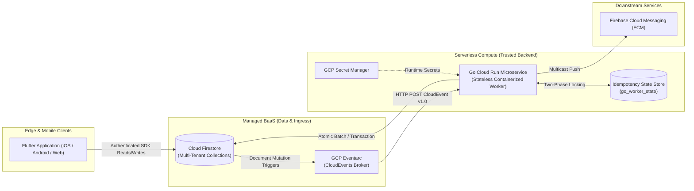
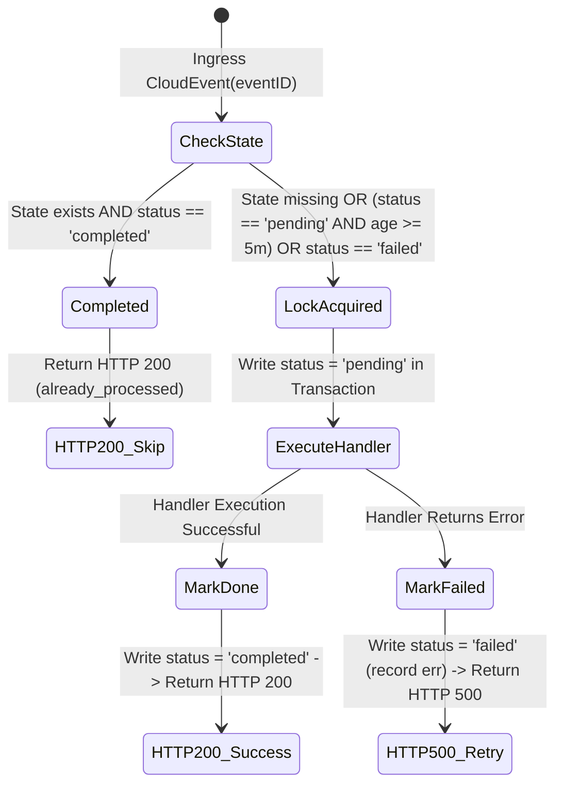
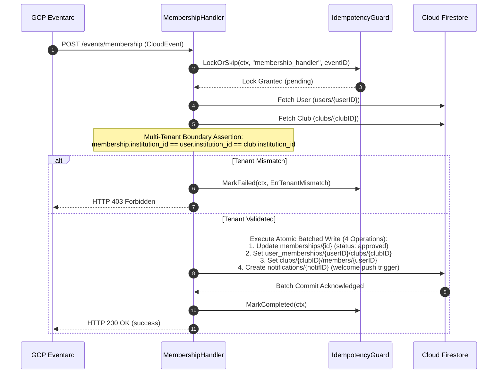
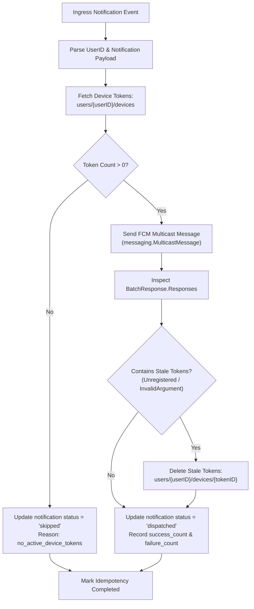

# KlubConnect — Cloud Backend Architecture & Technical Design Document

**System:** KlubConnect Event-Driven Backend Microservice  
**Runtime:** Go 1.22+ on Google Cloud Run  
**Trigger Mechanism:** GCP Eventarc (CloudEvents v1.0 over HTTP)  
**Persistence & State:** Google Cloud Firestore (Multi-Tenant)  
**Notification Bus:** Firebase Cloud Messaging (FCM HTTP v1)  

---

## 1. Executive Summary & Design Principles

KlubConnect employs a **hybrid edge/serverless event-driven architecture**. While read paths and low-privilege client operations utilize direct Firebase SDK connections for low-latency interactive UX, all **critical mutations, multi-document transactions, security-sensitive workflows, and high-contention aggregations** are offloaded to an asynchronous, containerized Go microservice.



### Core Architectural Principles

1. **Zero-Trust Client Boundary:** Clients never perform cascading multi-collection writes, counter aggregations, or write directly to audit ledgers. All multi-document invariant guarantees are enforced by the server.
2. **Deterministic Multi-Tenant Isolation:** Every operation verifies institutional boundaries (`institution_id`) across participating entities (users, clubs, events) prior to committing database changes.
3. **Exactly-Once Semantics via Distributed Idempotency:** Because Eventarc guarantees at-least-once delivery, all mutation handlers execute under a strict two-phase transactional lock to prevent duplicate side effects.
4. **Concurrency Safety without Hotspots:** Counter aggregations (such as event RSVPs) run inside transactional delta calculations, isolating high-frequency contention away from mobile clients.
5. **Scale-to-Zero Economics:** The Go service is stateless, lightweight (<20MB container footprint), boots in milliseconds, and scales from zero instances to meet spike event traffic with zero idle infrastructure costs.

---

## 2. Event Ingress & Routing Specification

The microservice exposes an HTTP server configured with standard middleware:
- **Panic Recovery Middleware:** Recovers from unhandled panics and returns RFC-compliant `500 Internal Server Error` with JSON error envelopes.
- **Structured Logging Middleware:** Captures method, path, HTTP status, execution latency, and trace context for Google Cloud Logging.

```
+---------------------------------------------------------------------------------------+
|                                    HTTP Router                                        |
+-----------------------------------+--------------------+------------------------------+
| Route                             | Ingress Method     | Primary Responsibility       |
+-----------------------------------+--------------------+------------------------------+
| /events/audit                     | POST (CloudEvent)  | Immutable Audit Logging      |
| /events/fcm                       | POST (CloudEvent)  | Multicast Push Notification  |
| /events/rsvp                      | POST (CloudEvent)  | Atomic RSVP Aggregation      |
| /events/membership                | POST (CloudEvent)  | Atomic Membership Approval   |
| /healthz                          | GET (Probe)        | Liveness / Readiness Check   |
+-----------------------------------+--------------------+------------------------------+
```

### CloudEvent v1.0 Parsing Engine

Handlers accept CloudEvents in both **Binary Mode** and **Structured Mode**:
- **Binary Mode:** Event metadata is extracted from HTTP headers (`ce-id`, `ce-subject`, `ce-type`, `ce-source`), and the Firestore `DocumentEventData` proto JSON is read from the request body.
- **Structured Mode:** The request body contains the complete CloudEvent envelope JSON (`id`, `subject`, `data`).

---

## 3. Distributed Idempotency & Concurrency Model

Event delivery systems (Eventarc/PubSub) operate on **at-least-once** delivery guarantees. Network retries, container preemptions, or duplicate triggers can result in repeated deliveries of the same CloudEvent.



### Idempotency Document Schema (`go_worker_state` collection)

Document ID format: `{handlerName}_{cloudEventId}` (scopes idempotency per handler).

| Field | Type | Description |
|---|---|---|
| `event_id` | `string` | Unique CloudEvent identifier |
| `handler_name` | `string` | Scoped handler name (e.g. `membership_handler`) |
| `status` | `string` | Lock state: `pending`, `completed`, or `failed` |
| `processed_at` | `timestamp` | UTC timestamp of last state transition |
| `error` | `string` | Error description if status is `failed` |
| `attempt` | `int` | Execution attempt counter |

### Two-Phase Transactional Protocol

1. **Phase 1 (Lock Acquisition):** Inside a Firestore Transaction:
   - If document exists with `status == "completed"`, abort execution and signal `already_processed`.
   - If document exists with `status == "pending"` and `now - processed_at < 5 minutes`, another worker is actively processing; abort and signal `already_processed`.
   - If lock is stale (`age >= 5 minutes`) or `status == "failed"`, increment `attempt`, reset `status = "pending"`, and claim lock.
   - If document does not exist, create with `status = "pending"` and `attempt = 1`.
2. **Phase 2 (Seal / Finalize):**
   - **On Success:** Update document to `status = "completed"`, `error = ""`.
   - **On Failure:** Update document to `status = "failed"`, record error message, allowing subsequent retries.

---

## 4. Subsystem Domain Specifications

### 4.1. Multi-Tenant Membership Approval Engine

**Trigger:** Document mutation on `membership_requests/{requestId}` where status transitions `pending -> approved`.



#### Data Invariants Enforced:
1. **Multi-Tenant Consistency:** Verification that user, club, and request belong to identical `institution_id`.
2. **Atomic Entity Synchronization:** Ensures bidirectional relationship indexing (`user_memberships` and `club.members`) commits atomically without partial failure.

---

### 4.2. Concurrency-Safe RSVP Aggregation Engine

**Trigger:** Create or update on `events/{eventId}/rsvps/{userId}`.

**Problem:** Simultaneous RSVP bursts (e.g. event registration launches) create document write contention hotspots if clients attempt to mutate aggregate counters directly.

#### Delta Vector State Machine

The handler maps state transitions to linear vector deltas $( \Delta_{\text{going}}, \Delta_{\text{interested}}, \Delta_{\text{not\_going}} )$:

$$\vec{V}(\text{status}) = \begin{cases} (1, 0, 0) & \text{status} = \text{"going"} \\ (0, 1, 0) & \text{status} = \text{"interested"} \\ (0, 0, 1) & \text{status} = \text{"not\_going"} \\ (0, 0, 0) & \text{otherwise} \end{cases}$$

$$\vec{\Delta} = \vec{V}(\text{status}_{\text{new}}) - \vec{V}(\text{status}_{\text{old}})$$

#### Transactional Execution:
1. Read current counters from `events/{eventId}` inside a Firestore transaction.
2. Apply delta vector:
   $$\text{counter}_{\text{new}} = \max(0, \text{counter}_{\text{current}} + \Delta)$$
3. Commit updated counters and `updated_at` timestamp atomically. If net delta is zero, database write is skipped.

---

### 4.3. Push Notification Orchestrator & Token Lifecycle

**Trigger:** Document creation on `notifications/{notificationId}`.



#### Token Lifecycle Management:
- Unregistered, expired, or invalid device tokens are automatically pruned from `users/{userId}/devices` in real time, preventing dead-token bloat and eliminating failed downstream multicast attempts.

---

### 4.4. Server-Side Immutable Audit Ledger

**Trigger:** Document mutation triggers across sensitive collections (`clubs`, `events`, `membership_requests`).

**Security Guarantee:** Client applications are restricted by Firestore Security Rules from writing directly to `audit_logs`. Only the trusted Cloud Run worker possessing Admin SDK privileges can append audit records.

#### Audit Record Contract:

```json
{
  "audit_id": "audit_ce_9a8b7c_1723680000000000000",
  "cloud_event_id": "9a8b7c-4d3e-2f1a",
  "actor_id": "user_2xK9L01",
  "target_collection": "clubs",
  "target_document_id": "club_robocraft_01",
  "action": "UPDATE",
  "timestamp": "2026-08-15T00:00:00Z",
  "changed_fields": ["president_id", "updated_at"]
}
```

---

## 5. Domain Boundary & Collection Ownership Matrix

| Collection Path | Primary Writer | Reader Access | Security Rule Constraint |
|---|---|---|---|
| `users/{uid}` | Client / Auth | Client, Worker | Tenant-isolated (`sameTenant`) |
| `users/{uid}/devices/{id}` | Client (FCM token registration) | Worker | Client write, Worker prune |
| `clubs/{clubId}` | Client (Faculty) / Worker (Members) | Client, Worker | Role-governed (`isClubManager`) |
| `events/{eventId}` | Client (Role Holders) / Worker (Counters) | Client, Worker | RSVP counts updated exclusively by worker/rules |
| `events/{eventId}/rsvps/{uid}` | Client (Student) | Worker | Direct client RSVP state record |
| `membership_requests/{reqId}` | Client (Student) | Client, Worker | Created by student, approved by manager |
| `notifications/{notifId}` | Client / Worker | Client | In-app notification queue |
| `audit_logs/{auditId}` | **Go Worker Exclusively** | Admins, Read-Only | `allow write: if false` for all clients |
| `go_worker_state/{stateId}` | **Go Worker Exclusively** | **Worker Exclusively** | `allow read, write: if false` for all clients |

---

## 6. Security, Authentication & IAM Architecture

1. **Workload Identity Federation:** The Go microservice runs under a dedicated Google Cloud Service Account (`sa-klubconnect-worker@...`) without exported static keys.
2. **Minimal IAM Role Bindings:**
   - `roles/datastore.user` — Firestore database access.
   - `roles/firebase.messagingAdmin` — FCM multicast messaging dispatch.
   - `roles/secretmanager.secretAccessor` — Read access to Secret Manager credentials.
3. **Defense-in-Depth Multi-Tenancy:**
   - Database layer: Firestore Security Rules validate `institution_id` match.
   - Application layer: Handlers validate `institution_id` across entities before batch execution.

---

## 7. Reliability, Observability & Lifecycle Management

### Graceful Shutdown Protocol

The worker handles OS signals (`SIGINT`, `SIGTERM`) to ensure zero-downtime rolling deployments on Cloud Run:

```go
shutdownCtx, shutdownCancel := context.WithTimeout(context.Background(), 10*time.Second)
defer shutdownCancel()

if err := server.Shutdown(shutdownCtx); err != nil {
    server.Close()
}
```

1. Cloud Run sends `SIGTERM` when scaling down or replacing an instance.
2. The HTTP server stops accepting new connections and finishes in-flight requests within a 10-second drain window.
3. Database client connections and open channels are closed cleanly before process termination.

### Health Probing
- **Endpoint:** `GET /healthz`
- **Response:** `200 OK` with JSON payload `{"status":"ok","timestamp":"..."}`
- Used by Cloud Run liveness and startup probes to gate traffic routing.

---

## 8. Summary Architecture Scorecard

| Dimension | Architectural Implementation |
|---|---|
| **Architecture Pattern** | Event-Driven Serverless Microservice (Go + Eventarc + Firestore) |
| **Delivery Semantics** | Exactly-Once (Guaranteed by Two-Phase Firestore Transactional Idempotency) |
| **Data Consistency** | ACID-Compliant Batched Writes (4 collections) & Distributed Transactions |
| **Tenant Model** | Logical Multi-Tenant Partitioning (`institution_id` boundary enforcement) |
| **Contention Model** | Vector Delta Aggregation (eliminating RSVP write locks) |
| **Push Notification** | Asynchronous Multicast with Automated Stale Token Pruning |
| **Audit Model** | Append-Only Server-Side Immutable Ledger |
| **Infrastructure Profile** | Scale-to-Zero Containerized Microservice (<20MB Image Size) |
